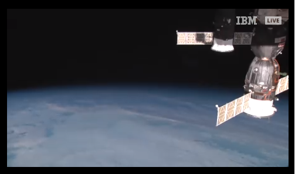
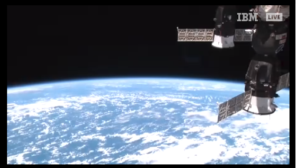

## MMM-EARTH-Live

* Live video of the Earth from the International Space Station.

During "loss of signal" periods, viewers will see a blue screen. Since the station orbits the Earth once
every 90 minutes, it experiences a sunrise or a sunset about every 45 minutes. When the station is in 
darkness, external camera video may appear black, but can sometimes provide spectacular views of lightning
or city lights below.

## Examples
The module is a live stream. These are still shots, obviously.

  

## Installation

* `git clone https://github.com/mykle1/MMM-ISS-Live` into the `~/MagicMirror/modules` directory.

## Config.js entry and options

    {
    disabled: f,
    module: 'MMM-EARTH-Live',
    position: 'bottom right',
    config: {
        height:"270px",
        width:"480px",
        useHeader: false,                // true if you want a header
        header: "",                      // Change in config file. useHeader must be true
        animationSpeed: 1000,            // fade speed
    }
},

